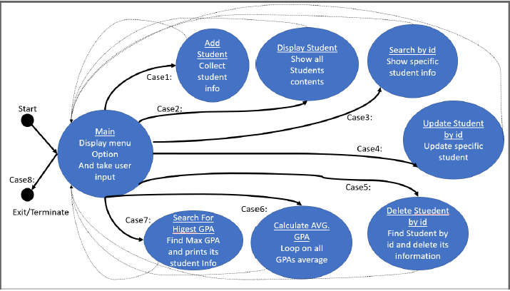

#  Student Management System (C)

A console-based Student Management System implemented in C using linked lists and state machine logic.

This project allows users to manage student records efficiently with dynamic memory allocation and structured data handling.

---

## 🚀 Features

- Add new student records
- Display all students
- Search student by ID
- Update student information
- Delete student record
- Calculate average GPA
- Find student with highest GPA
- Menu-driven state machine control

---

## 🧠 Concepts Used

- C Programming
- Linked List Data Structure
- Pointers & Dynamic Memory Allocation
- Structs
- State Machine Design
- Modular Programming
- Input Validation

---

## 📸 State Machine Diagram

---
## ▶️ How to Run

1. Clone the repository:
   git clone https://github.com/cherolos03/student-management-system-c.git

2. Navigate to src folder.

3. Compile:
   gcc main.c student.c -o student_system

4. Run:
   ./student_system
